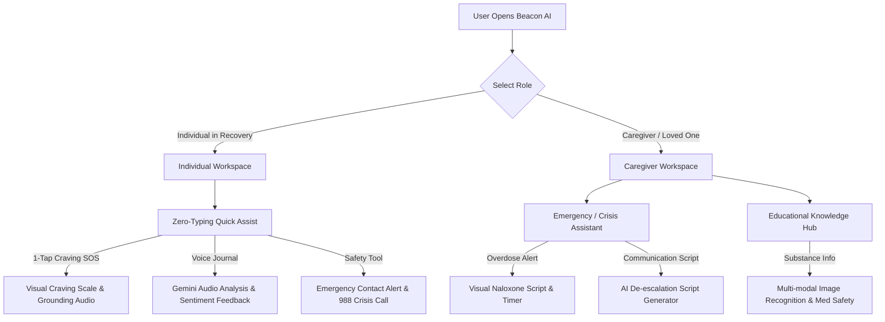
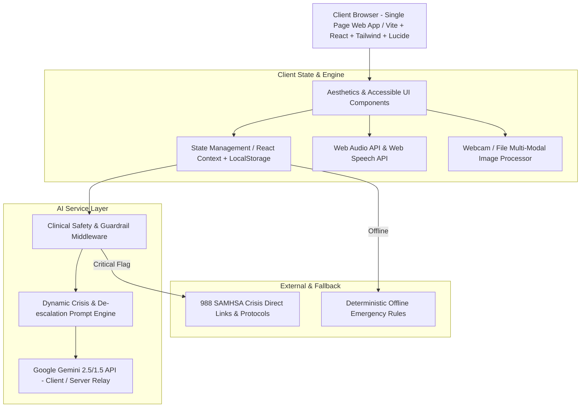
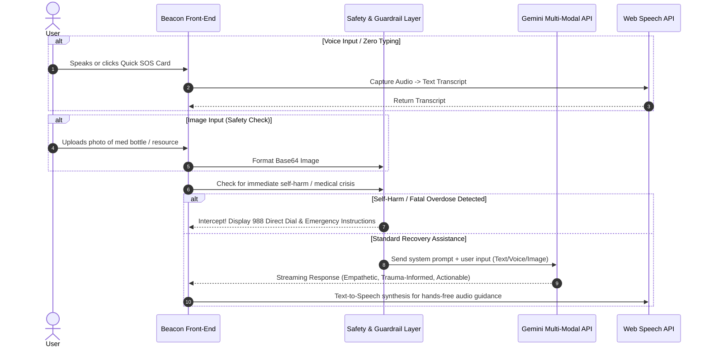

# Beacon AI — Multi-Modal GenAI Recovery & Caregiver Prevention Platform

## 1. Product Vision

**Beacon AI** is an emergency-ready, empathetic, multi-modal Generative AI platform designed to support individuals navigating Substance Use Disorders (SUD) and their caregivers. Built with a **privacy-first, zero-friction, trauma-informed UI/UX**, Beacon AI bridges the critical gap between acute distress and actionable recovery support through:

- **Zero-Typing Crisis Interventions**: One-tap visual cards, voice/audio interactions, and rapid emotion/craving assessment to prevent cognitive overload during acute craving or relapse risk.
- **Personalized De-escalation & Emergency Scripts**: Real-time context-aware guidance, de-escalation scripts for caregivers, and step-by-step overdose response protocols (including Naloxone/Narcan instructions with visual timer).
- **Multi-Modal AI Engine**: Voice-enabled journaling, visual mood/craving tracking, image/label recognition (substance risk identification, prescription guidance), and adaptive conversational AI powered by Google Gemini models.
- **Dual-Role Switching (Caregiver & Individual)**: Tailored dashboards and workflows for patients in recovery vs. loved ones/caregivers offering care without judgment or privacy breaches.
- **Context-Aware Safety & Guardrails**: Strict HIPAA/privacy design, offline fallback support, crisis hotlines integration (988 SAMHSA integration), and deterministic fallback rules to ensure AI safety.

---

## 2. Target Personas

### Persona A: Alex (Individual in Recovery)
- **Age**: 28 | **Condition**: Opioid & Alcohol Use Disorder (in early recovery)
- **Pain Points**: Overwhelmed by text during high-stress craving spikes; hesitant to reach out due to stigma; needs rapid zero-typing grounding tools.
- **Needs**: One-touch SOS / Craving Relief button, voice-guided breathing/grounding, instant non-judgmental AI support, safe trigger tracker.

### Persona B: Elena (Caregiver / Partner)
- **Age**: 45 | **Role**: Mother of a young adult managing Substance Use Disorder
- **Pain Points**: Panic during acute crisis/overdose suspicion; doesn't know what to say during intense arguments or relapse conversations; feels isolated.
- **Needs**: Real-time de-escalation scripts, step-by-step emergency Naloxone workflow, caregiver stress relief, boundary-setting educational micro-modules.

---

## 3. User Journey



---

## 4. Feature Prioritization (1-Hour MVP Execution Matrix)

| Priority | Category | Feature Description | Hackathon MVP Scope |
| :--- | :--- | :--- | :--- |
| **Must Have** | Core UI/UX | Dual Role Toggle (Individual / Caregiver Mode) | Dynamic, high-aesthetic theme switcher & mode layout |
| **Must Have** | Crisis/SOS | **Zero-Typing Intervention Hub** | 1-tap Craving Relief, Visual 1-10 Scale, Interactive Breathing Animation |
| **Must Have** | Emergency | **Emergency Script & De-escalation** | Overdose CPR/Narcan step-by-step guide + AI-generated de-escalation scripts |
| **Must Have** | AI Engine | **Multi-Modal Gemini AI Assistant** | Voice/Text recovery chat, visual image recognition for safety resources |
| **Must Have** | Safety | **Crisis Hotlines & Safety Guardrails** | 988 hotline direct link, emergency contact trigger, AI clinical safety guardrails |
| **Should Have**| Education | Personalized Educational Resources | Interactive cards for triggers, harm reduction, & boundary setting |
| **Should Have**| Analytics | Craving & Mood Recovery Logs | LocalStorage-backed streak, mood trends & journal history |
| **Nice to Have**| Community | Peer Support Finder & Local Care Map | Simulated geo-location directory for local SAMHSA centers |

---

## 5. System Architecture



---

## 6. Folder Structure

```
Promptwars_2026/
├── public/
│   ├── favicon.ico
│   └── audio/              # Pre-loaded calming/grounding audio assets
├── src/
│   ├── components/
│   │   ├── common/         # Navbar, Header, DualRoleToggle, Badge, Modal
│   │   ├── crisis/         # ZeroTypingSOS, GroundingBreathing, EmergencyScriptModal
│   │   ├── caregiver/      # DeescalationScriptGen, OverdoseGuide, CaregiverHub
│   │   ├── recovery/       # CravingTracker, VoiceJournal, RecoveryDashboard
│   │   ├── ai/             # MultiModalChat, ImageSafetyScanner, PromptSelector
│   │   └── education/      # ResourceLibrary, HarmReductionCards
│   ├── context/
│   │   ├── AppContext.jsx  # Role (Individual/Caregiver), Active Craving, Logs
│   │   └── AIContext.jsx   # Gemini API state, voice input/output state
│   ├── services/
│   │   ├── gemini.js       # Gemini API client integration & multi-modal processing
│   │   ├── prompts.js      # Structured system prompts & guardrail rules
│   │   └── storage.js      # Encrypted LocalStorage helper for zero-leak data
│   ├── styles/
│   │   └── index.css       # Tailwind CSS directives, glassmorphism & custom keyframes
│   ├── App.jsx             # Main router & layout shell
│   └── main.jsx            # React root mount
├── package.json
├── vite.config.js
└── README.md
```

---

## 7. Database Schema & Data Models (Client-Side Privacy-First Storage)

To guarantee zero data privacy risk during hackathon evaluation, all state is stored locally with client-side encryption support:

```typescript
// Role Definition
type UserRole = 'individual' | 'caregiver';

// Craving Log Entry
interface CravingLog {
  id: string;
  timestamp: string;
  intensity: number; // 1 - 10
  triggerCategory: 'stress' | 'environment' | 'social' | 'emotional' | 'physical';
  zeroTypingSelectedTags: string[];
  aiCopingAdvice: string;
}

// Emergency Script
interface EmergencyScript {
  id: string;
  scenario: 'acute_craving' | 'relapse_discussion' | 'overdose_suspicion' | 'boundary_setting';
  deescalationSteps: string[];
  caregiverTone: 'calm' | 'firm' | 'empathetic';
  recommendedActions: string[];
}

// Journal Entry (Voice/Text)
interface RecoveryJournal {
  id: string;
  timestamp: string;
  rawText: string;
  audioBlobUrl?: string;
  sentiment: 'hopeful' | 'struggling' | 'neutral' | 'determined';
  aiInsights: string[];
}
```

---

## 8. Component Hierarchy

- **`App`**
  - **`Navbar`** (Dual Role Switcher, Quick 988 SOS Button, Accessible High Contrast Toggle)
  - **`EmergencyBanner`** (Instant 1-Click CPR/Naloxone & 988 Dial trigger)
  - **`RoleWorkspace`**
    - **`IndividualDashboard`** (Role = Individual)
      - **`ZeroTypingSOSCard`** (Large interactive visual buttons: "Craving Now", "Panic/Anxiety", "Voice Vent", "Ground Me")
      - **`BreathingBox`** (Interactive CSS/SVG 4-7-8 visual breathing timer)
      - **`MultiModalRecoveryChat`** (Speech-to-Text input, AI voice output toggle, quick prompt chips)
      - **`VisualCravingTracker`** (Slider + Quick Tag Selector + Trend chart)
      - **`VoiceJournalingWidget`** (Audio recorder + Gemini Sentiment Analysis)
    - **`CaregiverDashboard`** (Role = Caregiver)
      - **`CrisisDeescalationGen`** (AI script builder: "What is happening right now?" -> Step-by-step verbal guide)
      - **`NaloxoneEmergencyGuide`** (Visual 5-step Naloxone administration walkthrough + countdown timer)
      - **`CaregiverSelfCareHub`** (Burnout assessment, boundary-setting scripts, supportive AI buddy)
  - **`SafetyFooter`** (Crisis Hotlines, SAMHSA disclaimers, HIPAA privacy badge)

---

## 9. AI Flow & Multi-Modal Engine Architecture



---

## 10. Prompt Engineering Strategy

### System Prompt 1: Recovery Companion (Individual Mode)
> *"You are Beacon AI, a compassionate, non-judgmental, trauma-informed recovery coach specializing in Substance Use Disorders. Your responses must be concise (under 3 sentences unless requested otherwise), highly supportive, and focused on immediate grounding strategies (e.g., 5-4-3-2-1 technique, deep breathing, urge surfing). Never shame, lecture, or provide unauthorized medical diagnoses. If self-harm or immediate overdose risk is detected, output the tag [EMERGENCY_TRIGGER] and provide immediate crisis hotline steps."*

### System Prompt 2: Caregiver De-escalation Assistant (Caregiver Mode)
> *"You are Beacon AI Caregiver Assistant. Your role is to provide de-escalation scripts for family members and caregivers dealing with acute addiction crises. Generate 3 short, concrete statements the caregiver can say right now using calm, non-confrontational, and boundary-respecting language. Always include one physical safety reminder."*

---

## 11. Accessibility Plan (WCAG 2.1 AA Compliance)

- **Visual Contrast**: High-contrast dark and light modes adhering to 4.5:1 ratio for text and interactive elements.
- **Cognitive Design**: Minimal text density during crisis states; large touch targets (at least 48x48px); clear visual iconography (Lucide icons).
- **Screen Reader Support**: Full ARIA labels (`aria-live="polite"` for AI responses, `aria-label` for all zero-typing buttons).
- **Keyboard Navigation**: Complete tab order and focus rings across all quick-assist cards and modals.
- **Multi-Modal Options**: Speech-to-text input and Text-to-speech output so users can operate hands-free without reading long blocks of text.

---

## 12. Security & Clinical Safety Considerations

1. **Zero-PII Storage**: No personal names, phone numbers, or passwords are stored on external servers. All user logs reside exclusively in browser `localStorage`.
2. **Clinical AI Guardrails**: Strict regex & semantic intercept for phrases indicating self-harm, active suicide intent, or medical emergency. Immediate fallback to 988 / 911 banner.
3. **Medical Disclaimer**: Clear persistent notice: *"Beacon AI is a supportive tool and does not replace professional medical treatment, clinical therapy, or emergency medical services."*
4. **API Key Protection**: Serverless proxy / environment variable sanitization for Google Gemini API keys.

---

## 13. State Management Strategy

- **React Context API (`AppContext`)**: Maintains active role (`individual` vs `caregiver`), current active crisis state, dark/light mode, and active modal overlays.
- **AI Context (`AIContext`)**: Manages streaming responses, speech synthesis state (playing, paused, volume), and multi-modal file uploads.
- **Persistent Local Cache**: Automatic synchronization of user streaks, craving logs, and saved de-escalation scripts to `localStorage`.

---

## 14. API Design (Gemini Integration Interface)

```javascript
// Example Gemini API Integration Service Signature
export async function generateRecoveryResponse({
  role,               // 'individual' | 'caregiver'
  mode,               // 'sos' | 'deescalate' | 'journal' | 'chat' | 'vision'
  userInput,          // text prompt or transcribed speech
  imageBase64 = null, // optional multi-modal image
  cravingLevel = null // optional 1-10 numerical context
}) {
  // 1. Select persona prompt based on role & mode
  // 2. Prepend clinical safety guardrails
  // 3. Dispatch to Gemini API (gemini-2.5-flash)
  // 4. Parse response & return text + audio TTS hooks
}
```

---

## 15. Deployment & Execution Plan (1-Hour Hackathon Sprint)

1. **Phase 1: Project Initialization & Setup (10 Mins)**
   - Initialize React Vite application with Tailwind CSS and Lucide Icons.
   - Set up Design System, CSS variables, and glassmorphism styling tokens.

2. **Phase 2: Core Components & Dual Workspaces (20 Mins)**
   - Build Navbar, Emergency Banner, and Dual-Role toggle switcher.
   - Implement `ZeroTypingSOSCard`, interactive `BreathingBox`, and `VisualCravingTracker`.
   - Build Caregiver `DeescalationScriptGen` & `NaloxoneEmergencyGuide`.

3. **Phase 3: Multi-Modal AI Engine & Guardrails (20 Mins)**
   - Integrate Google Gemini API service (`gemini.js`) with system prompts.
   - Build Web Speech API hooks for voice input and text-to-speech output.
   - Add image scanner modal for safety resource/medication identification.

4. **Phase 4: Polish, Accessibility & Testing (10 Mins)**
   - Audit keyboard navigation, contrast ratios, and ARIA labels.
   - Verify offline fallback state and crisis hotline links.
   - Build production bundle & verify clean dev execution.

---

## 16. README Outline

1. **Project Title & Tagline**: Beacon AI — Multi-Modal GenAI Recovery & Caregiver Prevention Platform
2. **Problem & Impact**: Addressing Substance Use Disorder (SUD) crises with zero-typing interventions & multi-modal AI.
3. **Key Features**:
   - Dual-Role System (Individual Recovery vs Caregiver De-escalation)
   - Zero-Typing Emergency SOS & Visual Craving Scale
   - Multi-Modal Voice & Vision AI Engine (powered by Google Gemini)
   - Step-by-Step Naloxone / Overdose Protocol & 988 Integration
4. **Tech Stack**: React 18, Vite, Tailwind CSS, Lucide React, Web Speech API, Google Gemini API.
5. **Quick Start / Installation**: Step-by-step `npm install` and `npm run dev` instructions.
6. **Clinical Safety & Privacy Architecture**: Zero-PII design and guardrail documentation.

---

## User Review Required

> [!IMPORTANT]
> **Implementation Approval Required**
> 
> Please review the comprehensive implementation plan above. It covers all 16 required technical and design components optimized for judging criteria:
> - **Code Quality**: Clean React architecture with modular components and Context API.
> - **Security**: Zero-PII client-side architecture with strict safety guardrails.
> - **Multi-modal AI**: Google Gemini integration for voice, text, and visual inputs.
> - **Real-world Usability**: Zero-typing interventions and dual-role workflows.
> 
> **No code has been written yet.** Once you approve this plan, execution will begin immediately.
